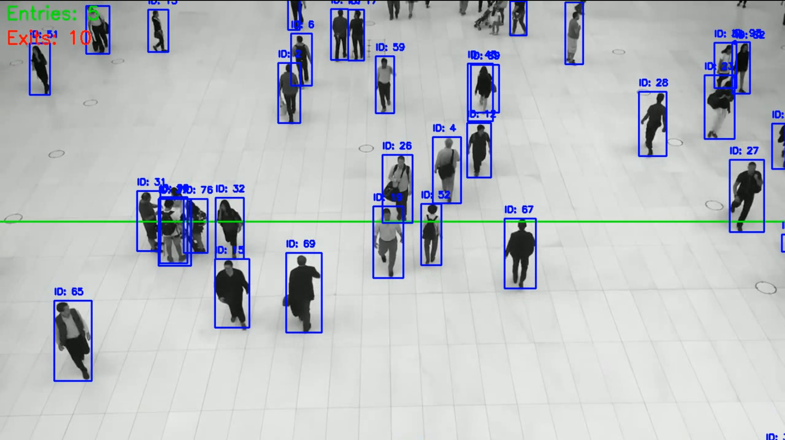

# Footfall Counter using YOLOv8 and DeepSort

This project implements a computer vision-based footfall counter to detect and track people, counting them as they enter or exit a predefined area.

## Approach

The solution uses a "detect-then-track" pipeline:

1.  **Detection**: The **YOLOv8n** model (from Ultralytics) is used for real-time person detection. It processes each video frame and identifies all instances of the 'person' class.
2.  **Tracking**: The **DeepSort** algorithm (using the `deep-sort-realtime` library) is used to track detected individuals across frames. DeepSort is robust and effective, matching detections to existing tracks based on appearance (re-identification) and motion (Kalman filter).
3.  **Counting**: A virtual horizontal line is defined in the script. The system counts an "entry" or "exit" when the centroid of a tracked person crosses this line.




## Video Source

* **Source:** YouTube
* **Link:** https://www.youtube.com/watch?v=WvhYuDvH17I&pp=ygUOcGVvcGxlIHdhbGtpbmc%3D
* **Description:** The video shows a top-down view of a shared open space, allowing for clear tracking of individuals as they pass.

## Counting Logic

The counting logic is based on centroid tracking and line-crossing:

1.  A horizontal line is defined by a constant `LINE_Y_POSITION`.
2.  A dictionary `track_history` stores the last known Y-coordinate of the centroid for each `track_id`.
3.  In each frame, for every tracked person:
    * The current centroid's Y-coordinate (`centroid_y`) is calculated from its bounding box.
    * The previous Y-coordinate (`prev_y`) is retrieved from `track_history`.
    * **Entry:** If `prev_y > LINE_Y_POSITION` and `centroid_y <= LINE_Y_POSITION`, the person has moved from *below* the line to *above* it. The **Entry** count is incremented.
    * **Exit:** If `prev_y < LINE_Y_POSITION` and `centroid_y >= LINE_Y_POSITION`, the person has moved from *above* the line to *above* it. The **Exit** count is incremented.
4.  The `track_history` is updated with the new `centroid_y`. This ensures a person is only counted once per crossing.

## Dependencies

* Python 3.11.7 
* ultralytics
* opencv-python-headless
* deep-sort-realtime
* numpy

## Setup and Usage

1.  **Clone the repository (or download the files):**
    ```bash
    git clone https://github.com/dysrea/footfall-counter.git
    cd footfall-counter
    ```

2.  **Install the dependencies:**
    ```bash
    py -m pip install ultralytics opencv-python-headless deep-sort-realtime
    ```

3.  **Download your test video:**
    Place your test video (e.g., `test_video.mp4`) in the root folder.

4.  **Update the script:**
    Open `footfall_counter.py` and change these two lines:
    ```python
    VIDEO_PATH = 'test_video.mp4'
    LINE_Y_POSITION = 360 # Adjust this Y-value to fit your video's layout
    ```

5.  **Run the script:**
    ```bash
    py footfall_counter.py
    ```

6.  **Check the output:**
    The script will process the video and save the result as `footfall_output.avi`. It will also print the final counts to the console.

## 💡 Scope for Improvement

While this solution meets the core requirements of the assignment, the project could be extended and improved in several key areas:

* **Robust Counting Logic (Buffer Zone):**
    The current logic counts a cross at a single-pixel line. This can be prone to "flickering" and miscounts if a person pauses directly on the line. A more robust solution would be to implement a "buffer zone" (a two-line tripwire) to confirm the *direction* of movement and ensure a person truly crosses the threshold.
    

* **Performance Optimization (Frame Skipping):**
    The current script runs the heavy YOLO detector on every single frame. This is computationally expensive. A significant speed-up could be achieved by running the detector only every N frames (e.g., every 5th or 10th frame) and relying on the lightweight DeepSort tracker's Kalman filter to predict movement in the frames in between.

* **Bonus Feature Implementation:**
    * **Real-time Processing:** The script can be easily modified to accept a live webcam feed by changing the `cv2.VideoCapture` source to `0` and using `cv2.imshow()` to display the live output.
    * **Trajectory Visualization:** The tracking history could be expanded to store a complete list of centroid positions for each `track_id`. These lists could then be used to draw path lines (`cv2.line`) for each person, visualizing their full trajectory.

* **Code Reusability (Command-line Arguments):**
    Instead of hard-coding values like `VIDEO_PATH` and `LINE_Y_POSITION`, Python's `argparse` library could be used. This would allow a user to pass in parameters from the command line (e.g., `py counter.py --video "test.mp4" --line_y 400`), making the script more flexible and professional.